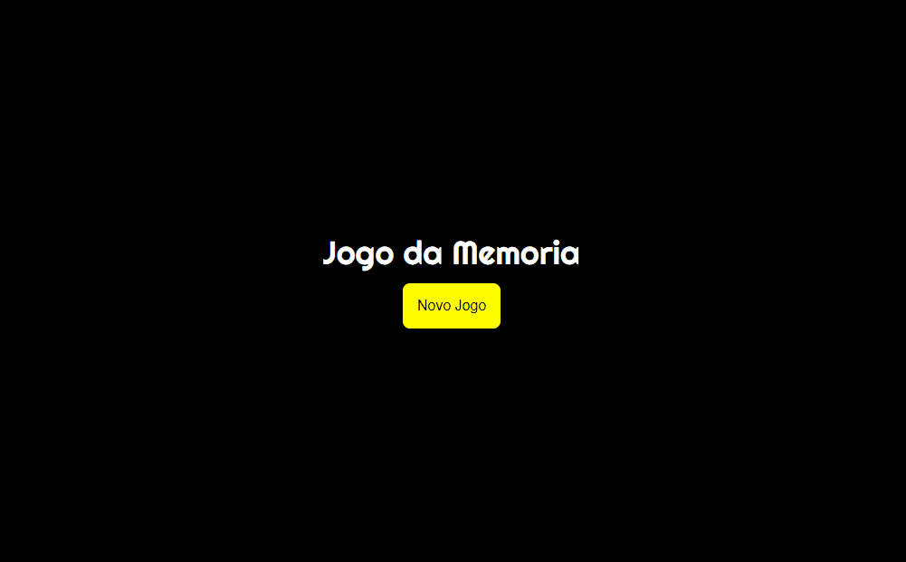

<h1 align="center">Jogo da Memoria  🚀</h1>

 Nesse desafio eu fiz um jogo da mémoria testando os conhecimentos adquiridos recentemente.

 <h1>✅ Features</h1>
 
 <ul>
     <li> O algoritimo cria as cartas automaticamente.
      <li> O algoritimo embaralhar as cartas automaticamente.
       <li> Possui um LockMode.
 </ul>

<h2 color="blue" align="center">
<a href="https://gustavomen.github.io/Jogo-da-Memoria/">🔗 Jogar</a>
</h2>

<h1 align="center">

<h1>✅ Tecnologias</h1>
 
 <ul>
     <li> HTML5
      <li> CSS3
       <li> JavaScript
 </ul>
 
<h1 > ✅ Status do Projeto </h1>
 
 
 🚧 Jogo da Memoria 🚀 Em construção... 🚧 

 
 
 <h1 align="center">Feito com ❤ por Gustavo Mendonça.</h1>
